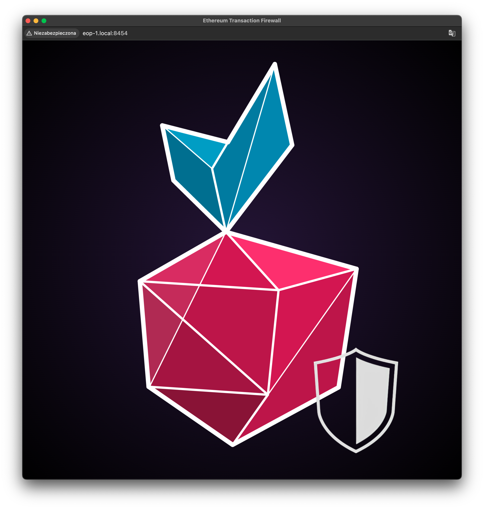
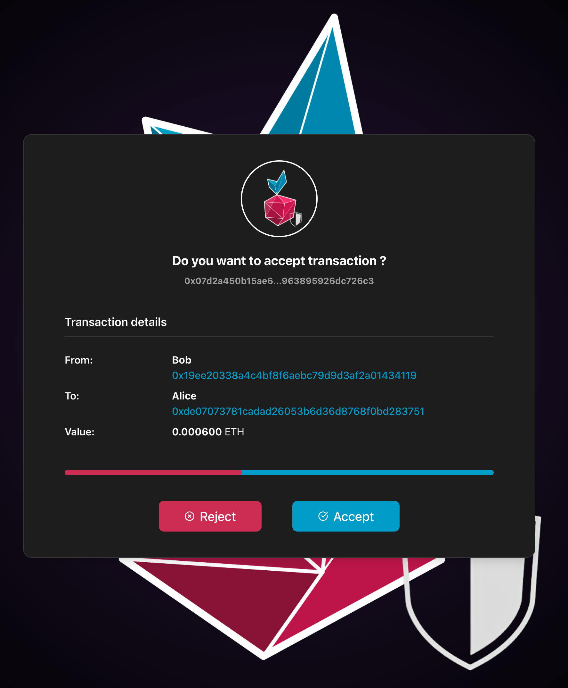
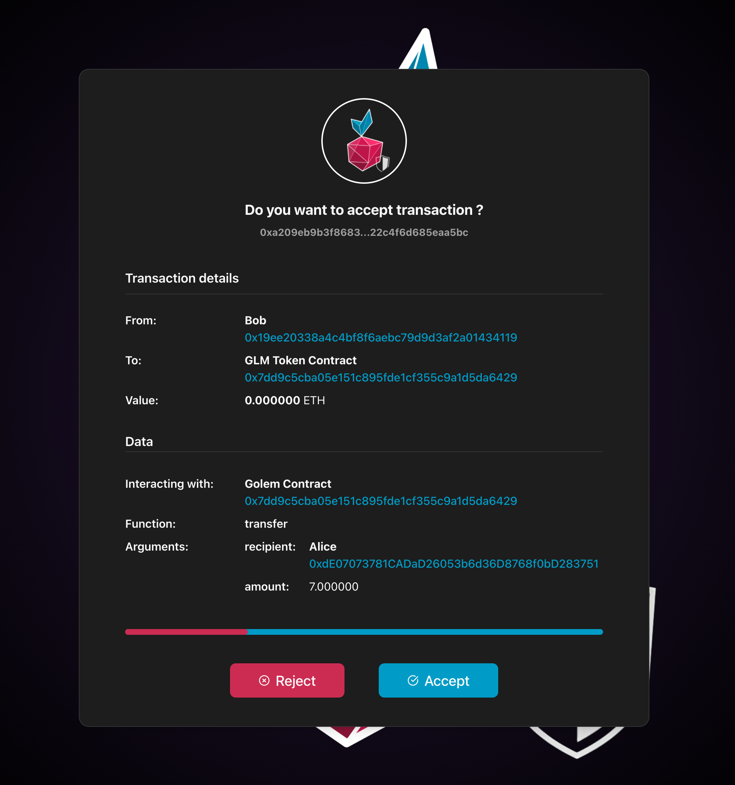
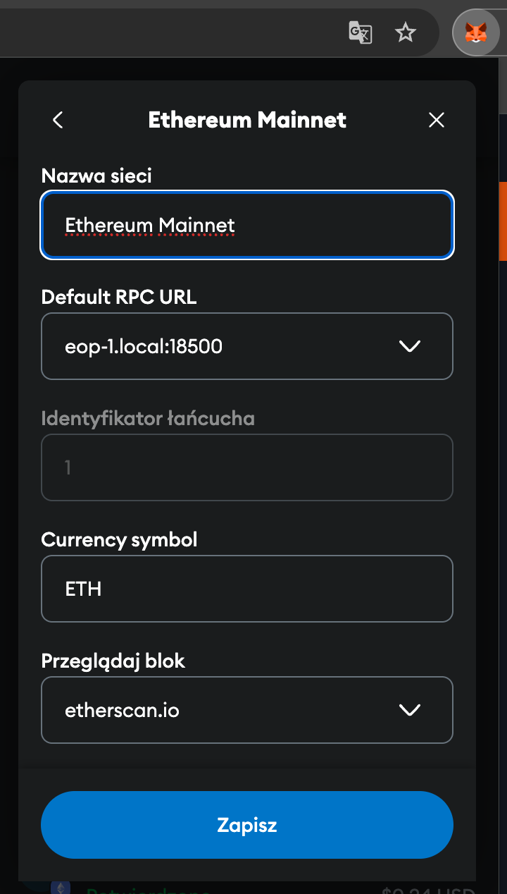

# Ethereum Transactions Firewall

This simple tool increases interaction security with Ethereum when accessed via a local RPC endpoint. It should be used with the [Ethereum On Raspberry Pi](https://github.com/Web3-Pi/Ethereum-On-Raspberry-Pi) suite.


## Setup

Log in to your Raspberry Pi and follow the instructions below.


### Node.js

This is a [Node.js](https://nodejs.org/) project, so if you don't have it installed on your device, follow the steps below:
```bash
sudo apt update
sudo apt install nodejs
sudo apt install npm
```

### Ethereum Transaction Firewall

Clone the current repository to your working directory and change the current directory to the working directory. Install dependencies by running the command: 
```bash
npm install
```

Copy template of environment file _.env_:
```bash
cp .env-template .env

```

#### Environment

The `.env` file allows you to configure various settings required for the Ethereum Transactions Firewall. Below is a
description of the available variables that you can set:

- `SERVER_PORT`: Port number where the main server will listen for incoming connections.  
  **Default:** `8454`

- `PROXY_PORT`: Port number used for the proxy service.  
  **Default:** `18500`

- `WSS_PORT`: Port number dedicated for WebSocket Secure (WSS) connections.  
  **Default:** `18501`

- `RPC_ENDPOINT`: The RPC endpoint used to communicate with your Ethereum or blockchain node.  
  **Example:** `http://localhost:8545`

- `AUTHORIZED_ADDR_PATH`: Path to the file containing the list of authorized addresses.  
  **Default:** `auth_addr.json`

- `KNOWN_CONTRACTS_PATH`: Path to the file containing information about known contracts mapped to their labels and abi.  
  **Default:** `known_contracts.json`

Be sure to restart the application after making changes to the `.env` file for them to take effect.


#### Authorized addresses

You can optionally assign a corresponding label to each authorized address. To do this, edit a file `auth_addr.json` and store the mapping in the file, e.g.:
```json
{
  "0x00000000219ab540356cBB839Cbe05303d7705Fa": "Beacon Deposit Contract",
  "0xC02aaA39b223FE8D0A0e5C4F27eAD9083C756Cc2": "Wrapped Ether",
  "0x7DD9c5Cba05E151C895FDe1CF355C9A1D5DA6429": "GLM Token Contract"
}
```

If any of these addresses are used, the firewall will label them accordingly.


#### Known contracts

You can optionally include the address of a known contract, its name, and its ABI. This allows the parser to decode its
functions and display the appropriate label during transactions.

To set this up, edit the `known_contracts.json` file and add the appropriate mappings. For example:

```json
{
  "0x7DD9c5Cba05E151C895FDe1CF355C9A1D5DA6429": "GLM Token Contract",
  "abi": [
    {
      "constant": true,
      "inputs": [],
      "name": "exampleFunction",
      "outputs": [
        {
          "name": "",
          "type": "string"
        }
      ],
      "payable": false,
      "stateMutability": "view",
      "type": "function"
    }
  ]
}
```

## Running

### Overview

The service is configured and ready to run. To start the service, execute the following command from the main project directory:
```bash
npm run build
npm start
```

On successful startup, the application will print the following (or similar) output:
```
INFO: WebSocket server listening on port 18501
INFO: Transaction Firewall HTTP Server (to accept/reject transactions): http://eop-1.local:8454
INFO: Validating Proxy is running
    Proxy address (endpoint to be used in a wallet): "http://eop-1.local:18500"
    Ethereum RPC endpoint used by the firewall: "http://eop-1.local:8545"
```

To start accepting transactions, open the web browser on a machine in a local subnet. The service is hosted on a local subnet, so the device name must be used in the web browser. In the default single-device setup, the device name should be _eop-1_, and the corresponding webpage is:
```
http://eop-1.local:8454
```
You should see a window:




### Details

- If the web page is not open, the service automatically forwards all requests to the configured RPC endpoint
- Only one web page instance may be opened at a time
  - Opening an additional webpage instance drops the old connection and redirects all queries to the current page
- This is an asynchronous service, but it serves only one request at a time
  - Requests are not queued
  - New requests sent during the processing of a previous one are automatically forwarded to the configured RPC endpoint
- If _known_contracts.json_  were provided, then the known contract calls will be rendered with additional details (e.g., custom GLM _transfer_ view will display the target address and the GLM amount)

#### Accepting simple transfer 


#### Accepting contract transaction


## Regular use

This project is a firewall between the wallet and the RPC endpoint (Ethereum mainnet only). Change the configured RPC endpoint to the proxy address to enable it in your wallet of choice.

### Metamask

#### Prerequisites

Before configuring the Metamask, make sure that your [Ethereum On Raspberry Pi](https://github.com/Web3-Pi/Ethereum-On-Raspberry-Pi) device (RPC endpoint) is synchronized and online. Let's assume that the default device name `http://eop-1.local` is used.

Make sure that the firewall is running. To launch it, follow [this instruction](#running).

#### Custom RPC endpoint configuration

To navigate to the network configuration window in Metamask, follow [the official Metamask instructions](https://support.metamask.io/networks-and-sidechains/managing-networks/how-to-add-a-custom-network-rpc/) and then fill in the required fields. For example (assuming that the firewall was launched with the default configuration options, i.e., the default port numbers):

| Metamask field                | Value                      |
| ----------------------------- | -------------------------- |
| Network name                  | _Ethereum txn firewall_    |
| New RPC URL                   | `http://eop-1.local:18500` |
| Chain ID                      | _1_                        |
| Currency symbol               | _ETH_                      |
| Block explorer URL (Optional) | `http://etherscan.io`      |



After setting up the custom RPC, you should see that the firewall processes requests from your Metamask (e.g., Ethereum state reads).

If you open the webpage associated with the firewall in a browser (i.e., `http://eop-1.local:8454`), you'll be able to inspect and then accept or reject all transactions submitted via Metamask.

## Testing

As [Ethereun On Raspberry Pi](https://github.com/Web3-Pi/Ethereum-On-Raspberry-Pi) devices are used with the Ethereum mainnet, the easiest way to interact with them would be through Metamask. It is fine during regular use but not helpful during testing.


### Sandbox Transactions

A simple testing framework was implemented for this project. It can interact with the service without the gas fees. Its only purpose is to allow transactions to be triggered by pressing keys from 1 to 5.

Currently, the following requests are submitted to the RPC endpoint:

```
1 - READ: requestBalance
2 - READ: requestBlockNumber
3 - READ: requestBlock
4 - READ: requestContractRead
5 - WRITE: requestErc20TransferTxn - GLM
```

#### Configuration

The testing framework sends transactions to a predefined RPC endpoint (i.e., a running Ethereum Transaction Firewall service). This endpoint can be specified in a file _test/txnemitter.js_, which looks like this:
```node
const process = require('process');
const path = require('path');

process.chdir(path.join(__dirname, '..'));

const { proxy_port } = require('../config/config');
const { DefaultTriggeredRequests } = require('./sandbox/requestgenerator');

const trigger = new DefaultTriggeredRequests(`http://localhost:${proxy_port}`);
```

To change the RPC endpoint, change the line:
```node
const trigger = new DefaultTriggeredRequests(`http://localhost:${proxy_port}`);
```
by adding the address of the correct RPC endpoint.


#### Running

With the correct RPC endpoint provided, run the tester from the main working dir by executing the following command:
```bash
node test/txnemitter.js
```
and send requests by pressing keys from 1 to 6.
