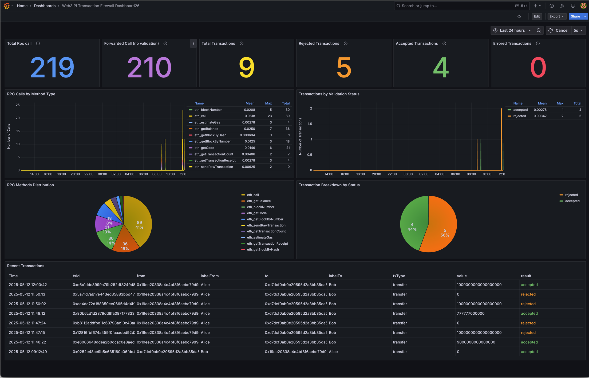

# Ethereum Transactions Firewall

This simple tool increases interaction security with Ethereum when accessed via a local RPC endpoint. It should be used with the [Ethereum On Raspberry Pi](https://github.com/Web3-Pi/Ethereum-On-Raspberry-Pi) suite.

## Setup

Log in to your Raspberry Pi and follow the instructions below.

### Node.js

This is a [Node.js](https://nodejs.org/) project, so if you don't have it installed on your device, follow the steps below:
```bash
sudo apt update
sudo apt install nodejs
sudo apt install npm
```

### Ethereum Transaction Firewall

Clone the current repository to your working directory and change the current directory to the working directory. Install dependencies by running the command: 
```bash
npm install
npm install --prefix frontend
```

Copy template of environment file _.env_:
```bash
cp .env-template .env

```

### Firewall Mode

The application supports two operational modes for the transaction firewall, which can be configured according to security requirements and operational needs:

#### Interactive Mode

In interactive mode, the application requires active user participation in the transaction decision-making process. Key features of this mode:

  - Each incoming transaction is presented to the user through the interface
  - The user can review transaction details (destination address, value, data, etc.)
  - The system awaits an explicit user decision (approve or reject) before continuing processing
  - Provides the highest level of control, ideal for critical operations or environments requiring human supervision
  - Uses UI frontend via websocket protocol for real-time communication with the user interface

#### Non-Interactive Mode

Non-interactive mode automates the transaction validation process based on predefined rules, eliminating the need for manual intervention. Key features:

  - Transactions are automatically verified against a predefined set of validation rules
  - Rules may include checking address allow/deny, value limits, gas fee restrictions, contract type verification, etc.
  - Validation occurs instantly without delays related to waiting for user response
  - Ideal for environments requiring high throughput or automation

The choice of mode depends on the specific use case, security level, and operational requirements. Interactive mode offers the highest level of control at the expense of performance, while non-interactive mode provides better scalability and automation at the cost of less flexibility in ad-hoc decision making.

The mode can be configured in the application configuration file using the `FIREWALL_MODE` parameter.

#### Environment

The `.env` file allows you to configure various settings required for the Ethereum Transactions Firewall. Below is a
description of the available variables that you can set:

- `FIREWALL_MODE`: Operational mode of the firewall. Can be set to either `interactive` for manual transaction approval
  or `non-interactive` for automated rule-based validation.  
  **Default:** `interactive`

- `SERVER_PORT`: Port number where the main server will listen for incoming connections.  
  **Default:** `8454`

- `PROXY_PORT`: Port number used for the proxy service.  
  **Default:** `18500`

- `WSS_PORT`: Port number dedicated for WebSocket Secure (WSS) connections.  
  **Default:** `18501`

- `RPC_ENDPOINT`: The RPC endpoint used to communicate with your Ethereum or blockchain node.  
  **Example:** `http://localhost:8545`

- `AUTHORIZED_ADDR_PATH`: Path to the file containing the list of authorized addresses.  
  **Default:** `auth_addr.json`

- `KNOWN_CONTRACTS_PATH`: Path to the file containing information about known contracts mapped to their labels and abi.  
  **Default:** `known_contracts.json`
- 
- `INTERACTIVE_MODE_TIMEOUT_SEC`: Timeout duration for user decision in interactive mode (in seconds).  
  **Default:** `60`

- `ADDRESS_RULES_PATH`: Path to file containing rules for allowed/denied address combinations.  
  **Default:** `address_rules.json`

- `VALUE_RULES_PATH`: Path to file containing rules for value and gas price limits.  
  **Default:** `value_rules.json`

- `CONTRACT_RULES_PATH`: Path to file containing rules for contract function calls.  
  **Default:** `contract_rules.json`

Be sure to restart the application after making changes to the `.env` file for them to take effect.

### Interactive Mode Configuration

#### Authorized addresses

You can optionally assign a corresponding label to each authorized address. To do this, edit a file `auth_addr.json` and store the mapping in the file, e.g.:
```json
{
  "0x00000000219ab540356cBB839Cbe05303d7705Fa": "Beacon Deposit Contract",
  "0xC02aaA39b223FE8D0A0e5C4F27eAD9083C756Cc2": "Wrapped Ether",
  "0x7DD9c5Cba05E151C895FDe1CF355C9A1D5DA6429": "GLM Token Contract"
}
```

If any of these addresses are used, the firewall will label them accordingly.


#### Known contracts

You can optionally include the address of a known contract, its name, and its ABI. This allows the parser to decode its
functions and display the appropriate label during transactions.

To set this up, edit the `known_contracts.json` file and add the appropriate mappings. For example:

```json
{
  "0x7DD9c5Cba05E151C895FDe1CF355C9A1D5DA6429": {
    "name": "GLM Token Contract",
    "abi": [
      {
        "constant": true,
        "inputs": [],
        "name": "exampleFunction",
        "outputs": [
          {
            "name": "",
            "type": "string"
          }
        ],
        "payable": false,
        "stateMutability": "view",
        "type": "function"
      }
    ]
  }
}
```

#### Predefined contract interfaces

If a contract address is not matched with any entries in the `known_contracts.json` file, the firewall attempts to recognize and match the contract data against a set of predefined standard interfaces:

- **Main standards**:
  - ERC20 - Standard interface for fungible tokens
  - ERC721 - Standard interface for non-fungible tokens (NFTs)
  - ERC1155 - Multi-token standard
  - ERC4626 - Tokenized vault standard

- **Popular extensions**:
  - ERC20Burnable - ERC20 extension allowing token burning

- **Popular utility contracts**:
  - Ownable - Contracts with ownership functionality
  - AccessControl - Contracts with role-based access control

All these interfaces are imported from the [OpenZeppelin](https://github.com/OpenZeppelin/openzeppelin-contracts) library, which provides secure and community-vetted implementations of common smart contract standards. This automatic detection allows the firewall to properly parse and display transaction data, enhancing security even when interacting with previously undefined contracts.

### Non-Interactive Mode Configuration

In non-interactive mode, the application uses three types of rules to validate transactions automatically without user intervention. Each rule type is configured in a separate JSON file, and the paths to these files are specified in the application configuration.

#### Address Rules

Address rules define policies for interactions between specific Ethereum addresses. Each rule specifies whether transactions between particular source and destination addresses should be allowed or denied.

To set this up, edit the `address_rules.json` file and add the rules. For example:

```json
[
  {
    "action": "allow",
    "from": "0x8626f6940E2eb28930eFb4CeF49B2d1F2C9C1199",
    "to": "0xdAC17F958D2ee523a2206206994597C13D831ec7",
    "comment": "Allow transfers to USDT contract"
  },
  {
    "action": "allow",
    "from": "*",
    "to": "0x7a250d5630B4cF539739dF2C5dAcb4c659F2488D",
    "comment": "Allow all addresses to interact with Uniswap router"
  },
  {
    "action": "deny",
    "from": "0x8626f6940E2eb28930eFb4CeF49B2d1F2C9C1199",
    "to": "0x6B175474E89094C44Da98b954EedeAC495271d0F",
    "comment": "Deny specific wallet from interacting with DAI contract"
  }
]
```
**Key features:**
- `action`: Either "allow" or "deny" to permit or block transactions
- `from`: Source address, use "*" as a wildcard to match any address
- `to`: Destination address, use "*" as a wildcard to match any address
- `comment`: Optional description of the rule purpose (recommended for maintenance)

Transactions are evaluated against each rule sequentially until a match is found. If a transaction matches a "deny" rule, it is rejected. If no matching rule is found, the transaction is rejected by default.

#### Value Rules

Value rules define constraints for transaction values and gas prices. These rules help prevent unwanted high-value transfers or excessive gas fees.

To set this up, edit the `value_rules.json` file and add the rules. For example:

```json
[
  {
    "minValue": 0,
    "maxValue": 1000000000000000000,
    "minGasPrice": 1000000000,
    "maxGasPrice": 50000000000,
    "comment": "Allow transactions up to 1 ETH with reasonable gas prices"
  },
  {
    "minValue": 0,
    "maxValue": 10000000000000000000,
    "minGasPrice": 1000000000,
    "maxGasPrice": 100000000000,
    "comment": "Allow transactions up to 10 ETH with higher gas price allowance"
  },
  {
    "minValue": null,
    "maxValue": null,
    "minGasPrice": 1000000000,
    "maxGasPrice": 30000000000,
    "comment": "Allow any value transaction with standard gas prices"
  }
]
```
**Key features:**
- `minValue`: Minimum transaction value in wei (use null for no lower limit)
- `maxValue`: Maximum transaction value in wei (use null for no upper limit)
- `minGasPrice`: Minimum gas price in wei (use null for no lower limit)
- `maxGasPrice`: Maximum gas price in wei (use null for no upper limit)
- `comment`: Optional description of the rule purpose

For EIP-1559 transactions, the system uses `maxFeePerGas` as the equivalent of `gasPrice` when evaluating these rules.

#### Contract Rules

Contract rules allow or deny interactions with specific smart contract functions. These rules provide fine-grained control over which contract functions can be called.

To set this up, edit the `contract_rules.json` file and add the rules. For example:
```json
[
  {
    "action": "allow",
    "functionName": "transfer",
    "args": {},
    "comment": "Allow transfer function calls"
  },
  {
    "action": "deny",
    "functionName": "approve",
    "args": {},
    "comment": "Block all approve function calls"
  },
  {
    "action": "allow",
    "functionName": "swapExactTokensForTokens",
    "args": {},
    "comment": "Allow Uniswap swap function"
  },
  {
    "action": "allow",
    "functionName": "transfer",
    "args": {
      "to": "0x1234567890123456789012345678901234567890",
      "value": "1000000000000000000"
    },
    "comment": "Allow transfer of 1 ETH to specific address"
  },
  {
    "action": "deny",
    "functionName": "approve",
    "args": {
      "spender": "*",
      "amount": "115792089237316195423570985008687907853269984665640564039457584007913129639935"
    },
    "comment": "Block unlimited token approvals"
  }
]
```
**Key features:**
- `action`: Either "allow" or "deny" to permit or block transactions
- `functionName`: Name of the contract function to match
- `args`: Object mapping parameter names to expected values (empty object matches any arguments)
- `comment`: Optional description of the rule purpose

- Contract rules are only applied to transactions that interact with smart contracts. Transactions that don't involve contract interactions automatically pass contract rule validation. **Important:** Contract rules require that the ABI for the target contract is pre-defined in the system's known contracts configuration file (specified by `KNOWN_CONTRACTS_PATH` in the environment configuration). Without the appropriate ABI, the contract's function calls cannot be decoded, and as a result, contract rules will not be matched, causing the transaction to be rejected by default.

## Running

### Overview

The service is configured and ready to run. To start the service, execute the following command from the main project directory:
```bash
npm run build
npm start
```

On successful startup, the application will print the following (or similar) output:
```
INFO: WebSocket server listening on port 18501
INFO: Transaction Firewall HTTP Server (to accept/reject transactions): http://eop-1.local:8454
INFO: Validating Proxy is running in interactive mode
    Proxy address (endpoint to be used in a wallet): "http://eop-1.local:18500"
    Ethereum RPC endpoint used by the firewall: "http://eop-1.local:8545"
```

To start accepting transactions, open the web browser on a machine in a local subnet. The service is hosted on a local subnet, so the device name must be used in the web browser. In the default single-device setup, the device name should be _eop-1_, and the corresponding webpage is:
```
http://eop-1.local:8454
```
You should see a window:


### Details

- If the web page is not open, the service automatically forwards all requests to the configured RPC endpoint
- Only one web page instance may be opened at a time
  - Opening an additional webpage instance drops the old connection and redirects all queries to the current page
- This is an asynchronous service, but it serves only one request at a time
  - Requests are not queued
  - New requests sent during the processing of a previous one are automatically forwarded to the configured RPC endpoint
- If _known_contracts.json_  were provided, then the known contract calls will be rendered with additional details (e.g., custom GLM _transfer_ view will display the target address and the GLM amount)

#### Accepting simple transfer 


#### Accepting contract transaction


#### Gas price warning

If the gas price (for legacy transactions) or fee per gas (for EIP-1559 transactions) is 10% higher than the average
If the gas price (for legacy transactions) or fee per gas (for EIP-1559 transactions) is 10% higher than the average
price calculated from the last 30 transactions, a warning about high gas price appears. This function only works if
`METRIC_MODE` is not set to none.


## Regular use

This project is a firewall between the wallet and the RPC endpoint (Ethereum mainnet only). Change the configured RPC endpoint to the proxy address to enable it in your wallet of choice.

### Metamask

#### Prerequisites

Before configuring the Metamask, make sure that your [Ethereum On Raspberry Pi](https://github.com/Web3-Pi/Ethereum-On-Raspberry-Pi) device (RPC endpoint) is synchronized and online. Let's assume that the default device name `http://eop-1.local` is used.

Make sure that the firewall is running. To launch it, follow [this instruction](#running).

#### Custom RPC endpoint configuration

To navigate to the network configuration window in Metamask, follow [the official Metamask instructions](https://support.metamask.io/networks-and-sidechains/managing-networks/how-to-add-a-custom-network-rpc/) and then fill in the required fields. For example (assuming that the firewall was launched with the default configuration options, i.e., the default port numbers):

| Metamask field                | Value                      |
| ----------------------------- | -------------------------- |
| Network name                  | _Ethereum txn firewall_    |
| New RPC URL                   | `http://eop-1.local:18500` |
| Chain ID                      | _1_                        |
| Currency symbol               | _ETH_                      |
| Block explorer URL (Optional) | `http://etherscan.io`      |


After setting up the custom RPC, you should see that the firewall processes requests from your Metamask (e.g., Ethereum state reads).

If you open the webpage associated with the firewall in a browser (i.e., `http://eop-1.local:8454`), you'll be able to inspect and then accept or reject all transactions submitted via Metamask.

## Testing

As [Ethereun On Raspberry Pi](https://github.com/Web3-Pi/Ethereum-On-Raspberry-Pi) devices are used with the Ethereum mainnet, the easiest way to interact with them would be through Metamask. It is fine during regular use but not helpful during testing.

### Unit tests

This project uses the Jest testing framework for unit tests. To run the unit tests, execute the following command in the
terminal:

```bash
npm run test:unit
```

### Integration tests

Integration tests for this project might involve:

- Simulating transaction requests and verifying correct forwarding or blocking behavior.
- Verifying that the validator interface accurately displays transaction details for user decisions.

To run the integration tests, execute:

```bash
npm run test:integration
```

### Sandbox Transactions

A simple testing framework was implemented for this project. It can interact with the service without the gas fees. Its only purpose is to allow transactions to be triggered by pressing keys from 1 to 5.

Currently, the following requests are submitted to the RPC endpoint:

```
1 - READ: requestBalance
2 - READ: requestBlockNumber
3 - READ: requestBlock
4 - READ: requestContractRead
5 - WRITE: requestErc20TransferTxn - GLM
```


With the correct RPC endpoint provided, run the tester from the main working dir by executing the following command:
```bash
npm run sandbox
```
and send requests by pressing keys from 1 to 5.


## Metrics

Ethereum Transactions Firewall supports metrics collection for performance monitoring. By default, metrics are displayed on standard output (stdout), but the system offers additional configuration options.

### Operation Modes

The following metrics collection modes are available:
- **stdout** - default mode, displays metrics in the console
- **none** - completely disables metrics collection
- **influx** - saves metrics to an InfluxDB database

### Environment Configuration

Metrics system configuration is managed through environment variables in the `.env` file:

```ini
# Sets the metrics collection mode: 'stdout', 'none', or 'influx'
METRICS_MODE=influx

# Number of metrics entries to batch before sending to InfluxDB
METRICS_BATCH_SIZE=100

# Interval (in milliseconds) at which metrics are saved to InfluxDB
METRICS_SAVING_INTERVAL_MS=10000

# Interval (in milliseconds) at which metrics are printed to stdout
METRICS_PRINTING_INTERVAL_MS=60000

# InfluxDB server URL
METRICS_INFLUX_URL=http://localhost:8086

# InfluxDB username for authentication
METRICS_INFLUX_USERNAME=admin

# InfluxDB password for authentication
METRICS_INFLUX_PASSWORD=web3-pi-password

# InfluxDB organization name
METRICS_INFLUX_ORG=web3-pi

# InfluxDB bucket (database) name where metrics will be stored
METRICS_INFLUX_BUCKET=ethonrpi
```

### Visualization with Grafana

The `grafana/dashboards` directory contains a sample dashboard that visualizes data collected in InfluxDB. This enables monitoring of key performance indicators for the system.



### Development Environment

For development purposes, you can quickly set up the required environment using Docker Compose:

```bash
docker compose up
```

This command will launch containers with InfluxDB and Grafana, configured to work with Ethereum Transactions Firewall. Once running, the Grafana panel will be available at http://localhost:3000 (login: admin, password: web3-pi-password).

Remember to properly configure the environment variables in your `.env` file to ensure metrics are correctly saved to InfluxDB.
