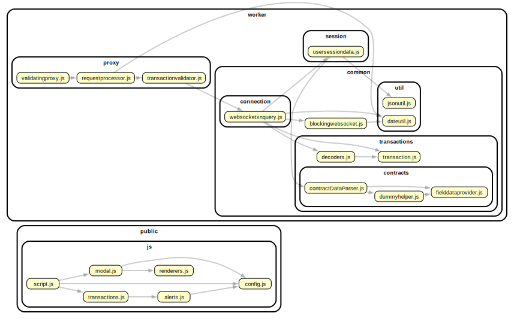

# REFACTORING PLAN

## Current implementation

The system is written for Node.js in Vanilla JS using Express as an HTTP server and the WS library for WebSocket.
Additionally, the request libraries are used, which require version updates, along with a few others as utilities.
The server-side (Worker) handles HTTP requests from the client, e.g., MetaMask, and also communicates with the frontend
part (Public) via WebSocket. The frontend part consists of static HTML/JS files served through Express.

The architecture of the system is shown in the diagram below.

## Current features

- The firewall works only if the frontend window is open and connected via websocket, otherwise, transactions are
  accepted.
- Only one transaction can be processed at a time. If a transaction is being processed, the next one "waiting" is
  automatically accepted.
- Only transactions of type `eth_sendRawTransaction` are validated, all others are accepted.
- Acceptance relies on clicking the Accept button, otherwise, it will be rejected after the timeout expires.

## Next steps

### Refactoring

1. Rewrite the code to TypeScript and use the latest versions of libraries like Express, ws, and fetch instead of
   request.
2. Consider reducing the complexity of the architecture.
3. Refactor the frontend using the latest CSS frameworks, e.g., Tailwind and Shadcn.
4. Support multiple WebSocket connections - implement queuing.
5. Add application wrapping as a Linux application (deb) that installs itself as a system service
6. Add more tests unit / e2e

## Features proposals

1. Add firewall modes. The current mode is `interactive` - it requires user interaction through the frontend. A
   `non-interactive` mode could be introduced, which automatically blocks everything except the whitelist (authorized
   addresses and contracts).
2. The non-interactive mode could work in two versions: whitelist and blacklist.
3. Log history as metrics - more structured than service logs - potentially useful for charts and table representation.
4. ... ?

